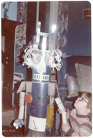

This page describes the <a href="#ops">practice</a> and ongoing <a href="#log">research</a> of Manchester-based theatre maker <a href="#gjh">G.J.Hilton</a> and company of collaborating artists. 

Working at the limits of contemporary ballet, the company's work incorporates robotics, puppetry, site-specific staging, biofeedback and custom real-time computer systems. GJH also collaborates extensively as a director, performer and scenographer.

GJH is - on several levels - one of the country's less conventional choreographers: Not himself a trained dancer, GJH approaches choreography as principally a series of problems in emergent spatial and temporal organisation. The resulting choreography is overwhelmingly visual, highly distinctive, and seldom less than extremely demanding. While the conception is formalist, the process often algorithmic, and the performers sometimes machines, audiences report experiencing the work as immediate, viscerally emotional and deeply human.

GJH cites his formative influences as <a href="http://en.wikipedia.org/wiki/John_McCarthy_(computer_scientist)">John McCarthy</a>, <a href="http://en.wikipedia.org/wiki/Ian_Curtis">Ian Curtis</a> and <a href="http://en.wikipedia.org/wiki/George_Balanchine">George Balanchine</a>&dagger;, and the work triangulates these three, with an emphasis on rigour of formal conception and execution, a bleak theatricality, but finally, a faith in beauty.

(&dagger; To be honest, it's anybody's guess how the work might be informed by GJH's other heroes, Charlie Chaplin, <a href="http://en.wikipedia.org/wiki/Jim_Henson">Jim Henson</a>, Marvin and Chuck D.)

 In <em>1981</em>, as a nerdy child, GJH built the robot to the left. It was made of cardboard and powered by make believe.

In <em>1997</em>, as a nerdy adult, GJH accidentally started a dance company. He's been trying to figure it out ever since.

The company's work has been seen internationally, <a href="http://mitpress.mit.edu/catalog/item/default.asp?ttype=2&amp;tid=11150">helped define the field of <em>digital performance</em></a>, and was nominated for a Paul Hamlyn Award for visual art. Collaborations with <a href="http://igloo.org.uk">Igloo</a>, Sue MacLennan, <a href="http://writingthebody.com">Darkin Ensemble</a> and others have toured nationally and internationally to four continents, and have been performed at the Royal Opera House, Place Prize, and Monaco Palais des Festivals.

The 'Company' in 'Hilton &amp; Company' isn't (just) an affectation, it's a deep acknowledgement that without the army of performers, technicians, managers, designers, builders, musicians, geeks and weirdos who've banded together over the years, this page would be a blank.

<!-- In particular, thanks are due to: Tamsin Drury, Julia Griffin, Kema T. Ekpei, greenroom, Sue MacLennan, Mike Byrne, Bruno Martelli, Ruth Gibson, Steve Curtis, Scott DeLaHunta, Fleur Darkin, and Tryste Wilber, as well as Gary Peploe, Alison Jaques, Mara Galeazzi, Alex Bradley, Jen McLachlan, Arts Council North West, Peter Lawton &amp; Alec Empire @ DHR, Gretchen Schiller, EssexDance, Susan Kozel, Jo Fong, Sue Davies, Johannes Birringer, Mark Bruce, Shobana Jeyasingh, Jools Gilson-Ellis, Luke Jennings, Jen Southern, Stuart Nolan and The Ballet Bag. -->

<small>(* In the Lisp programming language, <em>defun</em> is the macro that assigns a name to a function.)</small>